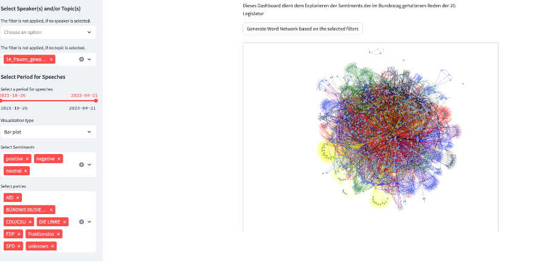

# Sentiment Analysis Dashboard for Bundestag Legislatur 20

This Streamlit dashboard is designed to visualize the sentiment analysis results of speeches given during the Bundestag's 20th legislative period.



## Features:

1. **Word Cloud**: Display a word cloud based on sentiments (positive, negative, neutral). 
2. **Data Filtering**: Users can filter data by speaker, topic, date, party, and sentiment.
3. **Various Visualizations**: Bar plots, pie charts, and area charts provide a comprehensive view of sentiments.
4. **Downloadable Data**: Processed data can be saved in CSV format for further analysis.
5. **Detailed Analysis**: View sentiments by each speech, by each politician, and by party.

## Dependencies:

- wordcloud
- streamlit
- pandas
- numpy
- plotly
- matplotlib
- nltk
- PIL
- streamlit_tags

## Setup:

1. Install the necessary libraries.

\```
pip install wordcloud streamlit pandas numpy plotly matplotlib nltk pillow streamlit-tags
\```

2. Download and place the necessary files and data in the project directory:
   - `DeutscherBundestagLogo.png`: Mask for the word cloud.
   - `quartzo.ttf`: Font for the word cloud.
   - `processed_dataframe.csv`: Processed data for BERT.
   - `processed_output_gpt.csv`: Processed data for GPT.

3. Run Streamlit app.

\```
streamlit run app.py
\```

## Usage:

- The sidebar provides multiple options for filtering and customizing visualizations.
- The main area provides visual insights, tables, and word clouds based on selected filters.
- The reset button in the sidebar allows users to quickly revert to default settings.

## Key Functions:

- `plot_wordcloud`: Generates a word cloud from a DataFrame.
- `load_data`: Loads data from the selected source.
- `st.cache_data`: A decorator to cache the data for streamlit.


## License:

MIT License
